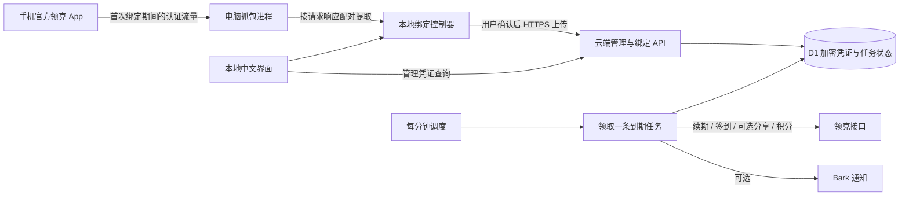

# 领克桌面助手与免费云端签到方案

- 日期：2026-09-20
- 状态：设计稿，供评审；本轮不实施、不部署。
- 代码基线：`main` / `9ebf847`。
- 目标：普通用户下载电脑程序，按向导导入手机领克 App 的现有登录态，随后由云端每天执行任务，电脑关机不影响执行。

## 1. 已确认的需求与前提

以下事实由用户确认，作为设计输入，不再作为待澄清问题：

1. 领克账号使用唯一登录态，需要复用手机官方 App 的会话。
2. 同一登录态下，手机与云端交替续期不会互相影响。
3. iPhone 信任抓包证书后可以正常抓包。
4. 同时面向安卓和 iPhone 用户。
5. 用户接受在电脑上双击程序，但不安装开发工具、不执行命令、不填写技术配置。
6. 每日执行必须在云端完成，电脑仅用于绑定和管理。
7. 用户不付软件费、抓包工具费或服务器费；优先将维护者的小规模云端费用控制在免费额度内。

本方案中的“绑定”是把手机已取得的授权交给云端任务使用。助手不自行发起另一轮领克短信登录，不收集领克账号密码。

## 2. 推荐方案与范围

采用：**Python 桌面启动器 + 本地网页界面 + 内置 mitmproxy + Cloudflare Workers 定时任务 + D1 持久化存储**。

桌面程序面向用户，云端由项目维护者统一部署。用户无需注册 GitHub、Cloudflare 或另一套邮箱账号。首轮通过一次性邀请码接入，邀请码由维护者提供。

第一版范围：

| 项目 | 第一版决定 |
| --- | --- |
| 规模 | 最多 20 个管理空间，每个空间绑定一个领克账号；属于试点上限，不是已验证容量 |
| 电脑 | Windows 10/11 x64、macOS 13+ 的 Apple Silicon 和 Intel 为打包验收目标 |
| 手机 | 安卓和 iPhone；发布说明列出实际验收的型号、系统和 App 版本 |
| 必选任务 | 每日签到、积分查询、自动续期、结果保存 |
| 分享任务 | 可选，默认关闭；具备并验证所需请求配置后才能开启 |
| 调度 | 默认每天北京时间 08:10 起分散执行；允许修改目标时间，不承诺秒级准点 |
| 结果 | 助手内展示最近 30 天结果；Bark 为可选通知，不作为安卓或 iPhone 使用前提 |
| 管理 | 立即执行、暂停、恢复、重新绑定、解绑、换电脑恢复管理权限 |
| 首次手动操作 | 填写一次邀请码、手机代理设置、证书安装与信任、在官方 App 触发登录或续期、确认授权 |

第一版不包括：多账号批量导入、商业运营后台、自动修改手机系统设置、手机常驻 VPN、Root/越狱方案、自动绕过验证码、无人确认的程序自动更新。

### 2.1 为什么选择本地网页界面

- 现有项目是 Python，适合继续用 Python 管理抓包进程和文件。
- 双击后自动打开系统浏览器中的本地页面，不要求用户启动服务或输入地址。
- Windows 和 macOS 共享同一套界面，不额外引入 Electron 的完整 Chromium 运行时。
- PyInstaller 将解释器、依赖和静态文件一起打包；用户机器无需安装 Python。[来源 S1]
- 代价是系统浏览器会打开一个页面，助手须管理好服务生命周期、端口占用和重复启动。

### 2.2 云端备选

| 路线 | 优点 | 本方案中的定位 |
| --- | --- | --- |
| Cloudflare Workers + D1 | 调度和存储在同一平台，均有免费套餐 | 首选，先完成 P0 性能与网络验证 |
| Vercel Hobby + 外部持久化数据库 | 可较多复用现有 Python | 个人自用备选，不能直接替换本文的每分钟调度；Hobby 每个定时任务每天一次，且限个人非商业用途 |
| 已有云主机运行 Python | 对现有代码适配较少 | 只有维护者已有可用机器时才讨论增量费用；不计作从零免费方案 |

Cloudflare 若无法满足免费版限制，应记录实测结果并重新评审运行平台或拆分方式，不静默升级付费，也不把“已有免费试用”写成长期零费用。[来源 S2、S3、S5、S6]

## 3. 用户完整流程

### 3.1 打开助手

1. 下载对应电脑平台的发布包，解压后双击。
2. 启动器启动本地服务并打开中文页面。重复双击复用已有进程和页面。
3. 首次输入维护者提供的一次性邀请码，助手创建独立管理空间，并把管理凭证写入系统凭据存储。
4. 自动检查网络、可用端口、云端连通性；多个网卡时提供可辨认的连接选项。

程序中内置默认服务地址，用户不填写域名、API 地址、AppSecret 或环境变量。

### 3.2 连接手机

1. 用户点击“添加账号”，选择安卓或 iPhone。
2. 页面显示当前电脑的局域网地址、代理端口、手机设置步骤和证书安装二维码。
3. 手机与电脑连接可互通的 Wi-Fi，用户在手机上配置代理、安装并信任证书。
4. 二维码只用于打开本次绑定的证书/连接页面，不承诺扫码自动修改代理和证书信任。
5. 手机访问连接页面后，助手关联本次手机来源；同一时间只处理一台手机的一次绑定。

若访客 Wi-Fi 隔离设备、系统防火墙阻止连接或选错网卡，显示对应的连接失败状态。必要的系统网络许可由用户通过系统提示完成，不要求执行防火墙命令或关闭系统防火墙。

### 3.3 获取完整凭证

1. 用户打开手机领克 App。
2. 助手解析登录或续期接口，按同一次请求与响应配对获取会话信息。
3. 如果只有普通业务请求中的短期 `token`，显示“等待完整登录凭证”，不进入成功状态。
4. 用户可等待官方 App 自然续期；为了立即完成，也可选择在手机官方 App 中重新登录一次。
5. 助手不自动退出手机账号、不自动发送短信、不替用户完成验证码。

本地状态：

`未连接 -> 手机已连接 -> 等待完整凭证 -> 凭证已获取 -> 云端验证中 -> 等待开启 -> 已绑定`

手机切换账号、取消绑定或超时后，清除本次候选数据；不把上一轮的设备信息拼进新的账号凭证。

### 3.4 云端验证并开启

为避免把应用签名密钥分发到所有电脑，**桌面端只做结构完整性检查，有效性验证在用户确认上传后的云端进行**：

1. 凭证齐全后，用户点击“验证账号”，明确同意把必要登录凭证交给云端使用。
2. 云端验证续期能力，用得到的有效 token 查询积分和签到状态，创建尚未开启定时任务的待确认记录。
3. 助手显示实际查询结果供用户核对。当前代码未提供稳定的昵称/手机号查询契约，因此不承诺自动显示手机号；可添加用户备注。
4. 用户点击“开启自动签到”，云端激活记录并安排首次任务。
5. 如果没有确认开启，待确认凭证在 10 分钟后被清理。失败或过期记录不可执行任务。

HTTP 成功不等于业务成功。续期、积分和签到状态接口都必须通过各自业务码和必要字段检查，才能进入“等待开启”。绑定校验阶段不执行签到或分享。

### 3.5 结束抓包

1. 确认绑定后，助手停止解析认证流量并清除内存中的完整凭证。
2. 界面引导用户关闭手机 Wi-Fi 代理，并提供删除抓包证书的步骤。
3. 在用户确认已关闭手机代理前，保留本次代理的必要透传能力，避免刚绑定成功手机就断网。
4. 用户确认后关闭代理进程；退出程序时仍提醒尚未完成的代理清理。

不能通过程序替手机清除系统代理。强制关闭电脑后遗留代理也会影响手机联网，这是向导必须覆盖的恢复场景。

### 3.6 日常使用

用户无需保持电脑开机。重新打开助手可查看结果、暂停/恢复任务、修改时间、手动触发、重新绑定或解绑。

登录失效后将任务状态改为“需要重新绑定”，停止反复调用领克接口。用户下次打开助手可见；配置了 Bark 的用户同时收到提示。第一版不承诺未配置通知且电脑关闭时仍能主动通知所有手机。

## 4. 系统架构



### 4.1 桌面端

| 模块 | 职责 |
| --- | --- |
| 启动器 | 单实例、选择空闲端口、启动和停止子进程、打开浏览器 |
| 本地界面/API | 向导状态、连接诊断、用户确认、云端任务管理 |
| 抓包进程 | 使用内置 mitmproxy/mitmdump，管理本机独立 CA 和当前代理会话 |
| 捕获插件 | 限定域名和接口，结构化解析请求/响应，输出归一化候选凭证 |
| 云端客户端 | HTTPS 通信、幂等重试、管理凭证与恢复流程 |
| 本地存储 | macOS Keychain / Windows 凭据管理器保存管理凭证；普通配置保存界面偏好 |

界面和管理 API 只监听 `127.0.0.1`。手机使用的代理和证书入口单独监听选定的局域网地址。证书入口只提供本次配对所需内容，不暴露本地配置、文件目录或管理 API。

本地页面使用启动时生成的随机会话凭证，并校验 Origin/Host，防止其他网页调用本地绑定接口。启动凭证不得放入远端请求或日志；交给本地页面后清理地址中的临时信息。

### 4.2 云端

采用 TypeScript Workers，D1 保存业务状态，Worker Secrets 保存应用签名密钥和数据加密主密钥。

现有 Python 的请求签名、接口约定和业务分支作为迁移依据，不宣称能在 Workers 上原样运行 `requests` 或 Android 模拟器。跨语言迁移使用相同脱敏输入和测试密钥验证签名结果，字节序列、空 body、查询排序和请求头必须与现有实现一致。

签名中的 HMAC-SHA256、数据加密使用 Web Crypto；接口要求的 Content-MD5 采用经过维护的现成实现。选定依赖后锁定版本，不自行编写密码算法。

不引入消息队列、常驻服务器或额外缓存层。P0 若证明单次免费执行不能承载完整任务，再独立评审任务拆分，避免在未验证前增加多套运行结构。

## 5. 登录态捕获和应用配置

### 5.1 捕获范围

默认仅对下列已知领克域名处理需要解析的 TLS 流量；其他域名透传，不解密和保存：

- `app-services.lynkco.com.cn`
- `app-api-gw-toc.lynkco.com`

认证接口初始规则：

| 接口 | 请求中的信息 | 响应中的信息 |
| --- | --- | --- |
| `/auth/login/refresh` | `refreshToken`、`deviceId`、设备/平台/版本头 | `data.centerTokenDto` 中的新 token、refreshToken 和有效期 |
| `/auth/login/mobileCodeLogin` | `hardwareDeviceId`、设备/平台/版本头 | `data.centerTokenDto` 中的登录结果 |
| `/auth/login/sliding/login` | 对应设备字段和平台信息 | 仅当业务成功且具备完整会话字段时接受 |

请求路径规则来源于现有代码。插件通过结构化 URL query、JSON body 和不区分大小写的 header API 解析，不扫描整段文本寻找“像 token 的字符串”。登录请求中的密码和短信验证码不进入候选数据、磁盘或云端。

完整凭证的最低要求：

- 成功响应中的非空 token。
- 成功响应中的 refreshToken；对于续期响应未返回新值的情况，才可使用同一次请求中的旧 refreshToken。
- 同一条登录/续期链路中的设备 ID。
- 手机平台及用于选择已验证协议模板的必要版本/设备上下文。

只在成功响应中选择最新凭证；如果存在多条冲突候选，要求重新确认候选，不静默覆盖已经展示给用户的账号。

### 5.2 设备上下文

保存原始来源明确的 `deviceId`、`gl_dev_id`、平台、App 版本、build、型号以及选定协议模板需要的字段。两种设备 ID 不保证相等，不能直接互相替代，也不能为已抓到的会话重新生成设备 ID。

手机实际平台与云端使用的请求协议模板分开记录。现有续期优先路径使用 iOS AppCode 请求模板，兜底采用原生 HMAC 模板；迁移时保留已验证的语义，不能只替换一个 `deviceType` 字符串就声称完成安卓适配。

### 5.3 应用级密钥

维护者使用现有工具提取并配置 `nativeAppKey`、`nativeAppSecret`；`nativeAppCode` 用于启用已验证的 AppCode 续期路径。应用密钥只进入云端 Secrets，不进入下载包、前端静态文件或公开仓库。

必须区分：

- 应用签名密钥：维护者统一配置和更新。
- 手机会话与设备信息：从本次授权流量提取，按账号保存。
- 分享接口额外请求配置：依据现有实现单独验证，缺失时禁用分享功能，不阻塞基础签到。

现有提取工具只写入两个应用字段，并不能自动准备全部配置。P0 必须给出实际必需字段清单及来源；维护者完成配置后服务才能开放邀请码，不能将缺失字段转交小白填写。

由于不由助手发起短信/滑块登录，新绑定主流程不依赖 `loginAppCode`。云端也不运行 Android 模拟器或 APK 密钥提取任务。

## 6. 管理身份、接口与数据

### 6.1 独立管理身份

一次性邀请码创建一个管理空间。首次使用返回随机管理凭证，桌面端保存到系统凭据存储；云端只保存其哈希。

提供一次性展示的恢复码，用户可导出恢复文件并自行保管。恢复码哈希存云端，换电脑恢复后轮换管理凭证和恢复码，旧凭证失效。未保存恢复码且原电脑凭证丢失时，需要新建空间并重新导入领克授权；旧空间只能由持有管理凭证者或维护者撤销，不自动认定新旧空间属于同一用户，也不通过“填写手机号”恢复管理权限。

邀请码和恢复码采用密码学安全随机数，服务端限定有效期、使用次数和尝试频率。第一版邀请码有效期为 7 天且仅可兑换一次；恢复码使用后失效并换发。解绑删除领克账号数据，但保留管理空间供再次绑定；维护者撤销整个管理空间时，其全部管理和恢复凭证一起失效。管理、恢复和邀请凭证均不与领克 token 混用。

### 6.2 对外接口约定

所有业务接口使用 HTTPS JSON，除兑换邀请/恢复入口外均验证管理凭证，并检查记录归属。

| 接口 | 输入/作用 | 返回和约束 |
| --- | --- | --- |
| `POST /v1/owners` | 兑换一次性邀请码 | 创建空间，返回管理凭证与恢复信息；同一兑换重试不得重复创建空间 |
| `POST /v1/owners/recover` | 提交恢复码 | 轮换管理凭证和恢复码；旧管理端退出 |
| `POST /v1/binding-candidates` | 提交完整捕获结果 | 云端续期和只读校验，返回候选编号、真实积分/签到预览、可用功能和 10 分钟有效期 |
| `POST /v1/binding-candidates/{id}/activate` | 用户确认开启 | 原子创建或替换当前绑定，排队首次任务；重复确认不重复创建任务 |
| `GET /v1/binding` | 查看当前绑定 | 返回状态、备注、执行时间、任务开关；不返回领克凭证明文 |
| `PATCH /v1/binding` | 修改暂停状态、时间或分享开关 | 返回新配置版本；分享不可用时拒绝开启并返回原因 |
| `POST /v1/binding/runs` | 请求立即执行 | 返回任务编号，实际执行由调度领取；当天已完成或存在执行中任务时返回既有任务 |
| `GET /v1/binding/runs` | 查询最近结果 | 分页返回最近 30 天记录 |
| `DELETE /v1/binding` | 解绑 | 禁止新执行并删除会话凭证、待确认候选和账号结果；已发往领克的请求无法撤回 |

所有创建/激活/手动执行请求携带独立的幂等键，数据库约束保证重试不重复写入。客户端不把断网或请求超时直接解释为“服务端没有完成”，重连后查询幂等结果。

邀请兑换和恢复接口的重试响应需要短时加密保存敏感返回值，仅对同一幂等键及原始有效兑换凭证重放，保留 10 分钟后销毁，避免响应丢失导致用户无法取得新管理凭证。

统一错误包括：`CAPTURE_INCOMPLETE`、`CREDENTIAL_INVALID`、`UPSTREAM_UNAVAILABLE`、`APP_CONFIG_UNAVAILABLE`、`CANDIDATE_EXPIRED`、`BINDING_PAUSED`、`QUOTA_REACHED`、`UNAUTHORIZED`、`CONFLICT`。界面将其转换为可执行的中文状态。

### 6.3 数据对象

| 对象 | 主要字段/约束 |
| --- | --- |
| `owners` | 空间编号、管理凭证哈希、恢复码哈希、创建时间；每空间最多一条有效绑定 |
| `invitations` | 邀请码哈希、到期时间、兑换状态；仅维护者可创建 |
| `binding_candidates` | 所属空间、加密的会话包、验证结果、到期时间；未激活不可调度 |
| `bindings` | 所属空间、备注、状态、加密会话包、凭证版本、协议模板、任务开关、目标时间、下次执行时间、执行租约 |
| `daily_runs` | 绑定编号、北京时间业务日期、步骤状态、重试次数、积分前后值、结果码、执行时间；绑定与日期唯一 |
| `idempotency_records` | 所属空间或兑换主体、操作、幂等键哈希、结果引用；敏感临时响应按上述规则加密并过期删除 |

服务生成绑定编号，不用 token、手机号或设备 ID 作为管理身份。只有上游经过验证的接口返回稳定账号标识时，才记录该标识；当前不假设积分接口一定返回它，也不承诺跨管理空间识别所有重复的领克账号。

会话包包含 token、refreshToken、两类有效期、设备上下文及版本，采用 AES-GCM 加密，随机 nonce，AAD 绑定空间和记录编号，主密钥与数据库分开保存在 Worker Secrets。云端为执行任务能够解密，因此这是受控托管，不是对维护者不可见的端到端加密。

## 7. 每日执行与故障恢复

### 7.1 调度

- 一个每分钟触发的 Cron，通过索引查询领取一条已到期记录，不在一次调用中遍历执行全部账号。
- 第一版调度采用北京时间业务日期，默认目标时间从 08:10 开始，在 20 分钟内按绑定编号分散。
- 到期记录按下次执行时间和稳定编号排序；前一任务超时不会让后续账号永远等待。
- 通过数据库条件更新领取租约，租约 180 秒；单次任务总耗时上限 120 秒，单个上游请求超时 30 秒。
- 到达总期限时取消仍在执行的本轮网络请求，不继续发起新的步骤。实际处理完成但响应丢失的写请求按“结果未知”处理。
- 同一绑定的定时、手动执行和重新绑定遵守租约及凭证版本检查，旧执行不能覆盖新绑定或解绑后的数据。

管理 API 的“立即执行”只排队并返回，不能依赖返回 HTTP 响应后的无限后台执行。正常无积压时目标为两分钟内开始，实际以运行状态展示。

修改执行时间和分享开关只影响下一次尚未开始的任务，不重新打开当天已完成的任务；暂停立即阻止新任务领取。重新绑定同一管理空间时沿用绑定编号与当日执行记录，避免换凭证造成当天重新执行。

同一 Cron 同时承担有界清理：到期候选在读取和激活时立即拒绝，每轮按索引删除最多 20 条到期候选、幂等临时记录或过期历史结果，剩余项留给后续轮次。清理消耗计入 P0 的单次 CPU 验证，不能用无界全表删除挤占任务预算。

### 7.2 执行顺序

`读取配置与租约 -> 获取有效 token/必要时续期 -> 保存最新凭证 -> 查询积分和签到状态 -> 按需签到 -> 可选分享 -> 查询积分变化 -> 保存结果 -> 可选通知`

关键规则：

1. 成功续期后优先持久化新凭证，并检查更新结果。存储失败则本轮停止，不用“签到成功”掩盖凭证丢失。
2. 查询签到状态失败时不得视为“尚未签到”。已签到不再次执行签到写操作。
3. 每个任务日期按步骤保存状态；重试先恢复已完成步骤，不重复运行整条链路。
4. 签到写请求结果未知时先重新查询签到状态；分享上报结果未知时不盲目重复上报，标记该步骤需核对。
5. 分享接口成功和积分增加分开展示，不能将无积分增长自动判定为应反复重试。
6. 分享失败不抹去签到成功结果；通知失败不重新执行签到。
7. 瞬时网络错误最多在首次失败后约 15 分钟和 60 分钟再次尝试；持久化次数并加少量随机偏移，不在一次调用里密集重试。
8. 明确的认证失效改为“需要重新绑定”；应用配置失效标记服务故障，不能要求所有用户重新登录解决。
9. 租约过期后恢复时，先核对步骤和凭证版本，再决定是否继续；暂停/解绑后不再领取新任务。

原接口的签名时序、幂等能力以及不确定写结果必须在协议回归用例中覆盖，不能只依赖本地日期唯一索引保证上游恰好执行一次。

## 8. 零成本边界与可行性门槛

截至 2026-09-20 核对的官方文档：

| 资源 | 免费套餐限制 | 对本方案的影响 |
| --- | --- | --- |
| Workers 请求 | 每天 100,000 次 | 每分钟 Cron 为每天 1,440 次，再加绑定与管理请求 |
| Workers CPU | HTTP 和 Cron 每次均为 10 ms | 必须验证签名、JSON、加解密、数据库处理和任务编排的整体消耗 |
| Workers 子请求 | 每次外部子请求最多 50 次；平台内部服务另按官方规则计数 | 单账号完整任务分别统计外部接口和 D1 等平台调用，不漏算重定向与重试 |
| Workers Cron | 免费账号最多 5 个 | 本方案只用 1 个 |
| D1 | 每天读 500 万行、写 10 万行，总存储 5 GB | 查询必须走索引，结果只保留 30 天；不是按 SQL 语句条数估算 |

来源 S2、S3、S4。网络等待不计入 Workers CPU，但仍影响任务总耗时；10 万请求额度不能证明单次任务一定能运行。

P0 放行条件：

- 从实际部署环境可访问领克接口，目标用户网络可访问管理端点和下载渠道。
- 基础签到与开启分享的完整流程分别测量：每次 CPU 不超过 10 ms，P95 目标不超过 8 ms；子请求留有余量，不触发资源限制。
- 使用脱敏固定响应覆盖主要分支至少 100 次，真实账号做必要的完整流程确认；不为凑性能样本重复执行真实写操作。
- 续期后的最新凭证能持久化并在新的执行实例使用。
- 按 20 个试点空间估算调度、管理、数据库扫描、写入及历史清理消耗，并验证任务不会长期积压。

超出免费额度时返回“额度不足/执行延后”，禁止自动升级套餐、自动购买资源。后台维护者可查看额度告警并暂停新邀请。人数增加必须重新压测和估算，本文不承诺无限人数或平台永久免费。

其他成本边界：

- 使用平台默认 HTTPS 地址，不要求用户或维护者购买域名。
- 软件打包和使用可以不收费；Windows/macOS 的发布者签名、平台公证是另一项发布成本，未签名试点包可能需要系统手动确认，不承诺零提示安装。
- 维护者仍需维护应用配置、处理异常和发布版本，人工工作不等于零成本。
- 选择已有 GitHub 发布渠道只用于代码/安装包分发，不表示每日任务运行于 GitHub Actions。

## 9. 数据与进程边界

- 每台电脑独立生成抓包 CA，私钥不上传、不与其他用户共用，文件访问权限限定到当前用户。
- 配对页面使用本次随机短期入口，只开放证书公钥和连通性检查；配对后限定当前手机来源，其他设备不能读取捕获结果。
- 默认不保存 HAR、pcap 或完整请求响应。日志仅包含状态、错误分类、接口名称和关联编号，token、验证码、管理凭证、设备标识不写明文。
- 从手机到本地代理的 TLS 解密仅用于用户启动的绑定会话；本地到云端使用正常 HTTPS，不使用抓包 CA 替代云端证书校验。
- 云端所有查询、修改、候选激活、手动运行和删除都按管理空间隔离。
- 解绑后立即删除在线凭证并阻止旧工作进程写回；历史备份的保留情况应在部署说明中明确，不承诺已生成备份会瞬间消失。
- 原始手机会话不保存在助手安装目录或打包解压临时目录；成功绑定后本机只长期保留管理凭证和必要非敏感配置。

## 10. 与现有仓库的关系

| 当前模块 | 可沿用的能力 | 新方案需要处理的差异 |
| --- | --- | --- |
| `lynkco_common.py` | 原生签名、配置字段、请求超时经验 | 签名迁移要按固定样本逐字节对齐；账号设备信息不能作为所有用户共享的环境变量 |
| `lynkco_login.py` | 续期接口、响应字段、有效期处理 | 云端存 D1，不写临时 `env.json`；保存 refreshExpireAt；不发起电脑端短信登录 |
| `lynkco_sign.py` | 查签到状态、执行签到、连续签到查询 | 统一检查业务成功；保留先查询再执行的顺序 |
| `lynkco_share.py` | 文章选择、分享接口和结果分类 | 分享可选；设备/风控请求配置单独验证；不确定写结果不盲目重放 |
| `lynkco_daily_tasks.py` | 积分前后对比、任务顺序 | 拆分可恢复步骤，支持暂停、租约、版本检查和跨实例续期 |
| `lynkco_notify.py` | Bark 格式和通知逻辑 | 通知与任务成功分离，第一版不强制用户配置 |
| `tools/appsecret_core.py` | 维护者提取应用 key/secret | 不随桌面绑定流程运行，不误认为已经提取了手机会话或全部设备配置 |
| `.github/workflows/daily-tasks.yml` | 现有脚本使用者的定时方式 | 保留原入口；新助手路线独立，不要求原用户迁移 |
| `LynkCoHelper/readme.md` | 现有部署和接口说明 | 实施后新增助手入口；以用户已确认的 iPhone 抓包方式修正文档的过时限制 |

建议新增目录，不为出方案提前重构原有模块：

```text
desktop/
  launcher.py                 # 单实例、服务与子进程生命周期
  local_api.py                # 本地页面与向导 API
  capture.py                  # mitmproxy 插件、请求响应配对
  binding.py                  # 凭证归一化与绑定状态机
  cloud_client.py             # 云端 API、幂等键与错误转换
  credential_store.py         # 系统凭据存储和恢复文件
  web/                        # 本地静态页面与图标
  packaging/                  # 各平台构建配置、第三方许可
cloud/
  src/index.ts                # 管理 API 与 scheduled 入口
  src/auth.ts                 # 空间、邀请、恢复与归属检查
  src/bindings.ts             # 待确认绑定、激活、修改、解绑
  src/lynkco/                 # 签名、续期、签到、分享协议适配
  src/runner.ts               # 领取任务与步骤恢复
  src/store.ts                # D1、租约、幂等和凭证版本
  src/crypto.ts               # 会话加解密
  migrations/                 # 数据表与索引
  wrangler.jsonc              # 部署配置，不包含明文密钥
tests/
  fixtures/                   # 测试密钥与脱敏协议样本
  desktop/                    # 捕获、状态机、进程与存储测试
  cloud/                      # 协议、隔离、调度与故障恢复测试
```

这些是后续实施的职责边界，本轮只创建本文档，不创建上述代码骨架。

## 11. 开发阶段

| 阶段 | 交付物 | 放行条件 | 初步工作量 |
| --- | --- | --- | --- |
| P0 协议与运行验证 | 手机样本解析、完整必需配置清单、云端单账号验证和资源报告 | 满足第 8 节；确认签到/分享各自可用能力 | 1-2 人日 |
| P1 本地绑定向导 | 可双击的原型、代理与证书入口、完整凭证状态机、退出清理 | 两类手机完成连接和完整提取；不写凭证明文日志 | 2-3 人日 |
| P2 云端闭环 | 邀请与管理身份、候选验证/激活、D1 持久化、单账号定时 | 电脑关闭后执行成功；服务重启后仍可续期；空间隔离有效 | 3-4 人日 |
| P3 恢复与管理 | 暂停/恢复、手动执行、重绑/解绑、恢复码、重试与结果页 | 重复请求、掉线、租约过期和旧凭证写回均有明确处理 | 2-3 人日 |
| P4 分发与试点 | 各平台包、说明、校验和、脱敏诊断、试点观察报告 | 无开发环境电脑可用；7 天定时观察通过 | 2-3 人日，另计观察时间 |

总量初步估计 10-15 人日，P0 后重新校准；不含额外的平台签名审核、不可用测试设备等待和上游协议重大变化。该估计不是交付承诺。

本方案通过评审后，按上述阶段分别细化实施计划，不一次性开展所有模块。

## 12. 验收清单

### 用户体验

- [ ] 在无 Python、Node、Android SDK、抓包软件的目标电脑上，发布包能双击启动。
- [ ] 安卓和 iPhone 用户均能完成向导；记录实际机型、系统和领克 App 版本。
- [ ] 用户不执行命令、不查找 token、不填写 JSON、AppSecret 或云服务配置。
- [ ] 只有短期 token 时不显示绑定成功；完整凭证才进入云端验证。
- [ ] 首次捕获窗口内切换手机账号，不会混用 token、refreshToken 和设备信息。
- [ ] 用户确认开启后才能执行签到/分享；取消或候选过期不执行任务。
- [ ] 结束流程包含关闭手机代理，手机随后可以正常访问网络。

### 云端行为

- [ ] 电脑关机后仍能执行每日任务；新的执行实例能读取上次保存的凭证。
- [ ] 查签到状态业务失败时不执行签到；已签到时不重复写入。
- [ ] 手动执行与定时重叠、按钮重复点击、请求响应丢失，不重复创建当天任务。
- [ ] 续期持久化失败、执行中断、租约过期、重新绑定和解绑有确定恢复行为。
- [ ] 分享失败与签到结果分开呈现；分享上报结果未知时不盲目重放。
- [ ] 暂停阻止新执行；解绑删除在线凭证，旧工作进程不能重新写回。
- [ ] 不同管理空间无法读取、激活、执行或删除对方记录。
- [ ] 恢复码使用后原管理凭证失效，新凭证可在换电脑后继续管理。
- [ ] 签名迁移覆盖请求头排序、查询参数、空 body、JSON 字节和有效期边界。

### 成本和发布

- [ ] 单次完整流程、每分钟调度、候选校验及管理接口均满足免费 CPU/子请求限制。
- [ ] 20 个试点空间下无持续任务积压，数据库查询与清理走索引。
- [ ] 超额或服务故障显示真实状态，不自动产生付费订阅。
- [ ] 日志、诊断包、安装包和公开仓库不包含真实登录凭证或应用签名密钥。
- [ ] 系统凭据存储不可用时明确报错，不退回安装目录明文保存。
- [ ] 发布包附版本、校验和、第三方许可及已测平台列表。
- [ ] 7 天观察记录签到结果、续期结果、错误分类、CPU、子请求和数据库消耗。

## 13. 仍需用工程验证回答的问题

这些问题不推翻第 1 节已确认事实，但决定代码和发布范围：

1. 完整云端流程在 Workers 免费 CPU 限制内的实际消耗，尤其是加解密和分享分支。
2. 当前应用密钥、协议模板和按账号设备字段的最小有效组合；缺失分享字段时的功能限制。
3. 实际云端出口到领克接口，以及用户网络到服务和安装包渠道的可达性。
4. 各平台打包后 mitmproxy 进程、系统凭据存储、网络许可和本地证书流程的表现。

采用验证报告决定是否放行，不以“已能抓包”替代云端执行验证，也不重复质疑用户已确认的同会话续期行为。

## 14. 参考资料

外部资源与额度核对日期：2026-09-20。免费政策和限制以实际部署时官方说明为准。

- S1：[PyInstaller 打包机制](https://pyinstaller.org/en/stable/operating-mode.html)
- S2：[Cloudflare Workers 资源限制](https://developers.cloudflare.com/workers/platform/limits/)
- S3：[Cloudflare Workers 价格与免费套餐](https://developers.cloudflare.com/workers/platform/pricing/)
- S4：[Cloudflare D1 价格与免费额度](https://developers.cloudflare.com/d1/platform/pricing/)
- S5：[Vercel 定时任务限制](https://vercel.com/docs/cron-jobs/usage-and-pricing)
- S6：[Vercel Hobby 使用条件](https://vercel.com/docs/plans/hobby)
- S7：[mitmproxy 证书与信任说明](https://docs.mitmproxy.org/stable/concepts/certificates/)
- S8：[Apple 手动信任证书说明](https://support.apple.com/en-us/102390)
- S9：[Cloudflare Cron Triggers](https://developers.cloudflare.com/workers/configuration/cron-triggers/)
- 代码依据：`LynkCoHelper/lynkco_login.py`、`lynkco_common.py`、`lynkco_sign.py`、`lynkco_share.py`、`lynkco_daily_tasks.py`、`tools/appsecret_core.py`。
